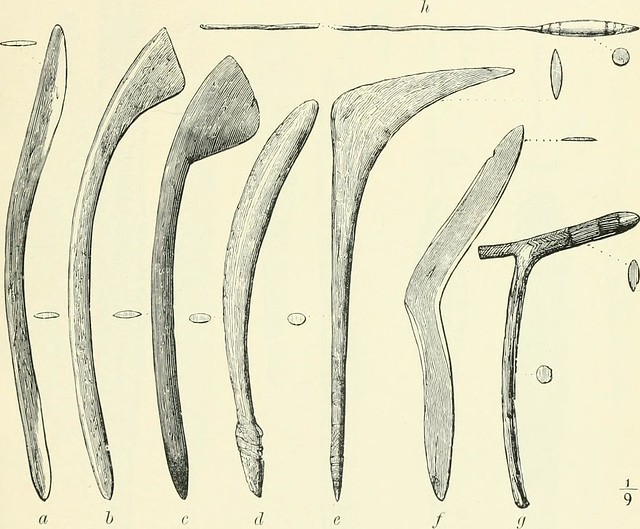

Boomerang Catcher (BC) is the ImageJ & python program set to analyze FRET in viral infected cells.

**[Download latest version](https://github.com/ishibaki/boomerang_catcher/releases/latest)**

# Please cite the paper when you use this program

Doysabas, K.C., et al. (2020) "ATeam technology for detecting early signs of viral cytopathic effect" J. Vet. Med. Sci. *in press*

# How to Use

## Image Preparation

BC tries to analyze an image file named as `img.tif`.  
BC requires `img.tif` to follow the rules;

1. File name should be `img.tif`
2. `img.tif` should be hyper-stacked
    1. Different images should be stacked into Z-direction
    2. In each Z-stack, two channels (channel 1 and 2) should be set
    3. `img.tif` should contain at least two Z-stacks
3. All images should be taken in same condition

## Making Hyperstack

There is a lecture video (`1_how_to_make_hyperstack.mov`).

1. Gather image files into one directory
    - I recommend to follow the naming rule;
        - `1_1.tif` for image-1, channel-1
        - `1_2.tif` for image-1, channel-2
        - `2_1.tif` for image-2, channel-1
        - ...
2. Open ImageJ, and click `File` -> `Import` -> `Image Sequence...`
3. Select **the directory** containing the images described in step 1
4. Click `Open`
5. A new window will open, and click `OK`
6. A stacked image will be imported
7. Select `Image` -> `Hyperstacks` -> `Stack to Hyperstack...`
8. Select `Order` as xyczt (default)
9. Change `Channels (c):` as `2`
10. Change `Slices (z):` as the half number of the total images
11. Click `OK`
12. Select `Image` -> `Rename...`, change file name as `img.tif` and click `OK`
13. Save the `img.tif` by selecting `File` -> `Save As...` -> `Tiff...`
14. Select the directory where you want to save the `img.tif`, and click `Save`

## Run ImageJ Program

1. Open the `img.tif` by dragging and dropping the file into the ImageJ control bar
2. Select `Plugins` -> `Macros` -> `Run...`
3. Select `190918_masking_measure.ijm` and click `Open`
4. Program will run and detecting cells
5. You will find windows named as `C1-img.tif`, `C2-img.tif`, `Result of filter2.tif`, and `Results`
    - `C1-img.tif` shows the detected cells in channel 1
    - `C2-img.tif` shows the detected cells in channel 2
    - `Result of filter2.tif` shows the detected area and area-ID
    - `Results` shows the 1st-step data
6. **Save the table file, `Results`, by selecting `File` -> `Save As...`**
7. Click `Save`
8. **If you need, save the images in your proper directories**

## Run Python Program

2nd-step analysis will be performed by Google Colaboratory.
[This is the link](https://research.google.com/colaboratory/faq.html) to briefly understand Google Colaboratory.

In this step, you need to mount Google Colaboratory to your Google Drive.
If you have not mounted it yet, [follow this instruction](https://sites.google.com/site/muratalaboratory/home/colaboratory).

1. Access to [Boomerang Catcher Python Program](https://colab.research.google.com/drive/1JS3whBHoUTOepOhsDkoEsUR_E-5a_TVP)
2. Click the `Connect` in the upper right
3. Click the `>` sign on the left side of the window
4. New tab will appear, and click `File`
5. By clicking `Upload` or dropping the `Results` to the left side tab
6. After finishing the upload, click the grey triangle mark of the top row
7. After running the first row, click the next grey triangle
8. After running the second row, click `Refresh` in the left side tab, and you will find `out.csv`
9. Click right button of your mouse on the `out.csv`, and click `Download`
10. Save the file your directory
11. In the `out.csv`, you can find `Ch2/Ch1-Ratio` column: this is the final data

# Analyzing Algorithm

1. Subtracting Background to enhance contrast from channel-2 image
2. Next, enhance contrast until saturating 0.3 % of pixels
3. Apply Gaussian Blur, sigma equals to 4
4. Apply threshold by [Minimum method](https://www.ncbi.nlm.nih.gov/pubmed/5220765) to detect cell body without nucleus (Filter 1)
5. Select the area with 50 - 500 $\mu$m^2^
6. Thresholded image of step 4 is duplicated
7. Apply threshold by [Otsu method](http://ieeexplore.ieee.org/xpl/freeabs_all.jsp?&arnumber=4310076) to detect cell body including nucleus (Filter 2)
8. Select the area with 50- 800 $\mu$m^2^
8. By multiplying the **inverted** Filter 1 and Filter 2, and generate nuclear mask (Filter 3)

9. Measuring the average intensity of channel-1 and channel-2 by detecting Filter 1 (data calculating cell body including nucleus) (Data 1)
10. Measuring the average intensity of channel-1 and channel-2 by detecting Filter 3 (data calculating only nucleus) (Data 2)
11. Calculate `((Area of Data 1) * (Mean Intensity of Data 1) - ((Area of Data 2) * (Mean Intensity of Data 2))) / ((Area of Data 1) - (Area of Data 2))` for each channel
12. Calculate `(Mean Intensity of Channel-2) / (Mean Intensity of Channel-1)`

<!-- {{{ code
```
run("Split Channels");
selectWindow("C2-img.tif");
run("Duplicate...", "duplicate");
rename("filter1.tif");
run("Duplicate...", "duplicate");
rename("filter2.tif");
selectWindow("filter1.tif");
run("Subtract Background...", "rolling=50 stack");
run("Enhance Contrast...", "saturated=0.3 normalize equalize process_all");
run("Gaussian Blur...", "sigma=4 stack");
setAutoThreshold("Minimum dark");
run("Analyze Particles...", "size=50.00-500.00 show=Masks exclude clear add stack");
selectWindow("filter2.tif");
run("Subtract Background...", "rolling=50 stack");
run("Enhance Contrast...", "saturated=0.3 normalize equalize process_all");
run("Gaussian Blur...", "sigma=4 stack");
setAutoThreshold("Minimum dark");
run("Analyze Particles...", "size=50.00-800.00 show=Masks exclude clear include stack in_situ");
selectWindow("Mask of filter1.tif");
run("Invert",  "stack")
imageCalculator("Multiply create stack", "filter2.tif", "Mask of filter1.tif")
selectWindow("Result of filter2.tif")
setAutoThreshold("Otsu dark");
run("Analyze Particles...", "size=30-350 circularity=0.6-1.00 show=Masks exclude include add in_situ stack");
run("Set Measurements...", "area mean min centroid center perimeter fit shape stack display redirect=None decimal=8");
selectWindow("C1-img.tif");
roiManager("Measure");
selectWindow("C2-img.tif");
roiManager("Measure");
selectWindow("C1-img.tif");
imageCalculator("AND stack", "C1-img.tif","filter2.tif");
imageCalculator("Subtract stack", "C1-img.tif","Result of filter2.tif");
selectWindow("C2-img.tif");
imageCalculator("AND stack", "C2-img.tif","filter2.tif");
imageCalculator("Subtract stack", "C2-img.tif","Result of filter2.tif");
selectWindow("Mask of filter1.tif");
run("Close");
selectWindow("ROI Manager")
run("Close");
selectWindow("filter2.tif")
run("Close");
selectWindow("filter1.tif")
run("Close");
```

```python3
import pandas as pd
import numpy as np

df = pd.read_csv('Results.csv', index_col=0)
df_ch1 = df[df['Label'].str.startswith('C1')]
df_ch2 = df[df['Label'].str.startswith('C2')]
diff = np.array(df_ch1['Slice'].iloc[1:]) - np.array(df_ch1['Slice'].iloc[:-1])
delimiting_point = np.where(diff < 0)[0][0] + 1

df_ch1_cellbody = df_ch1.iloc[0:delimiting_point, :]
df_ch1_nuclear = df_ch1.iloc[delimiting_point:, :]
df_ch2_cellbody = df_ch2.iloc[0:delimiting_point, :]
df_ch2_nuclear = df_ch2.iloc[delimiting_point:, :]

for nuc_index in df_ch1_nuclear.index:
    x, y, z= df_ch1_nuclear.loc[nuc_index, ["X", "Y", "Slice"]]
    area_nuc, mean_nuc = df_ch1_nuclear.loc[nuc_index, ["Area", "Mean"]]
    same_slice = df_ch1_cellbody[df_ch1_cellbody["Slice"] == z]
    dx2 = np.square(same_slice["X"] - x)
    dy2 = np.square(same_slice["Y"] - y)
    coord_index = np.argmin(np.sqrt(dx2 + dy2))
    
    area_cell, mean_cell = df_ch1_cellbody.loc[coord_index, ["Area", "Mean"]]
    mean_cell = ((area_cell * mean_cell) - (area_nuc * mean_nuc))\
                /(area_cell - area_nuc)
    df_ch1_cellbody.loc[coord_index, "Mean"] = mean_cell
    df_ch1_cellbody.loc[coord_index, "Area"] = area_cell - area_nuc

for nuc_index in df_ch2_nuclear.index:
    x, y, z= df_ch2_nuclear.loc[nuc_index, ["X", "Y", "Slice"]]
    area_nuc, mean_nuc = df_ch2_nuclear.loc[nuc_index, ["Area", "Mean"]]
    same_slice = df_ch2_cellbody[df_ch2_cellbody["Slice"] == z]
    dx2 = np.square(same_slice["X"] - x)
    dy2 = np.square(same_slice["Y"] - y)
    coord_index = np.argmin(np.sqrt(dx2 + dy2))
    
    area_cell, mean_cell = df_ch2_cellbody.loc[coord_index, ["Area", "Mean"]]
    mean_cell = ((area_cell * mean_cell) - (area_nuc * mean_nuc))\
                /(area_cell - area_nuc)
    df_ch2_cellbody.loc[coord_index, "Mean"] = mean_cell
    df_ch2_cellbody.loc[coord_index, "Area"] = area_cell - area_nuc
    
ch2_ch1_ratio = np.array(df_ch2_cellbody["Mean"])\
                /np.array(df_ch1_cellbody["Mean"])

df_ch1_cellbody = df_ch1_cellbody.rename(columns={"Mean": "Ch1_Mean"})
df_ch1_cellbody["Ch2_Mean"] = np.array(df_ch2_cellbody["Mean"])
df_ch1_cellbody["Ch2/Ch1-Ratio"] = ch2_ch1_ratio

out = df_ch1_cellbody.loc[:, ['Label', 'Area', 'Ch1_Mean', 'Ch2_Mean',
                              'Ch2/Ch1-Ratio', 'Min', 'Max', 'X', 'Y',
                              'XM', 'YM', 'Perim.', 'Major', 'Minor', ' Angle',
                              'Circ.', 'Slice', 'AR', 'Round', 'Solidity']]

out.to_csv("out.csv")
```
}}} -->

<!-- vim: set foldmethod=marker : -->
